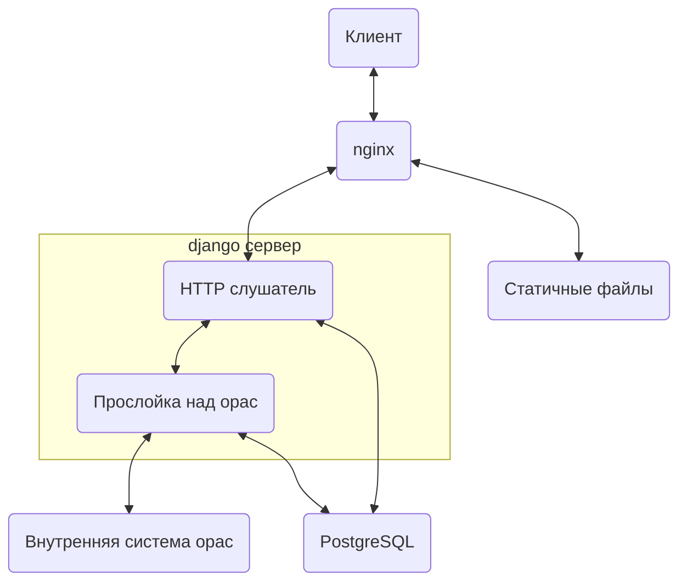
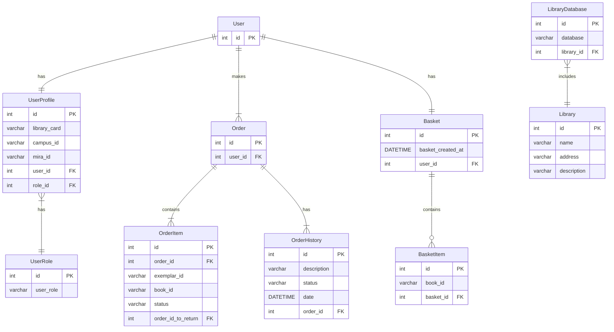

# Сервис онлайн заказа литературы

1. [Описание сервиса](#описание-сервиса)
2. [Описание проекта](#описание-проекта)
3. [Работа с проектом](#работа-с-проектом)

## Описание сервиса

Сервис позволяет через сайт производить заказ литературы из библиотек ИрНИТУ.

## Описание проекта

### Диаграмма компонентов проекта



### ER-диаграмма базы данных на сервере



## Работа с проектом

### Структура директорий проекта

В корне проекта находятся файлы, связанные с проектом в целом. В том числе к ним относится конфигурация для запуска на проде и описание Docker-контейнеров.  
В директории `docs` находится OpenAPI документация проекта.  
В директории `backend` находится код для бэкенда на Django.  
В директории `client` находится код для веб-клиента на Vue.

### Запуск приложения

#### Локальный запуск

Для запуска фронтенда используется nodejs:
```sh
cd client
npm install # Установка зависимостей
npm run dev
```

Для запуска бэкенда рекомендуется создать виртуальное окружение python, из которого сервис запускается следующим образом:
```sh
cd backend
pip install -r requirements.txt # Установка зависимостей
python manage.py runserver
```  

Так же можно в директории `backend` создать файл `local_settings.py` с настройками, специфичными для вашего окружения и запускать сервер через:
```sh
python manage.py runserver --settings local_settings
```

#### Запуск на проде

В корне необходимо создать два файла: `prod_settings.py` и `.env`. Рекомендуется скопировать в них текст из соответствующих им .example файлов: `prod_settings.py.example` и `.env.example`.  

После этого требуется дополнительное заполнение созданных файлов. Файл `prod_settings.py` можно оставить как есть, однако в некоторых случаях все же могут потребоваться дополнительные специфические для django настройки. Обязательным является заполнение в файле `.env` следующих полей:
 - `POSTGRES_PASSWORD` (пароль СУБД)
 - `LIBRARY_PORT` (на каком порте будет хоститься сервис)
 - `DJANGO_SECRET_KEY` (секретный ключ для Django).  

Пароль для БД рекомендуется генерировать случайно:
```sh
openssl rand -hex 32 | tr -d '\n'
```  

Для генерации ключа в Django используется следующий код на Python:
```python
from django.core.management.utils import get_random_secret_key
print(get_random_secret_key())
```  

После того, как данные файлы были заполнены, можно приступать к запуску сервиса с использованием docker compose или podman compose:
```sh
sudo docker compose build
sudo docker compose up -d
```  

Сервис будет запущен на порту, указанном в `LIBRARY_PORT`
